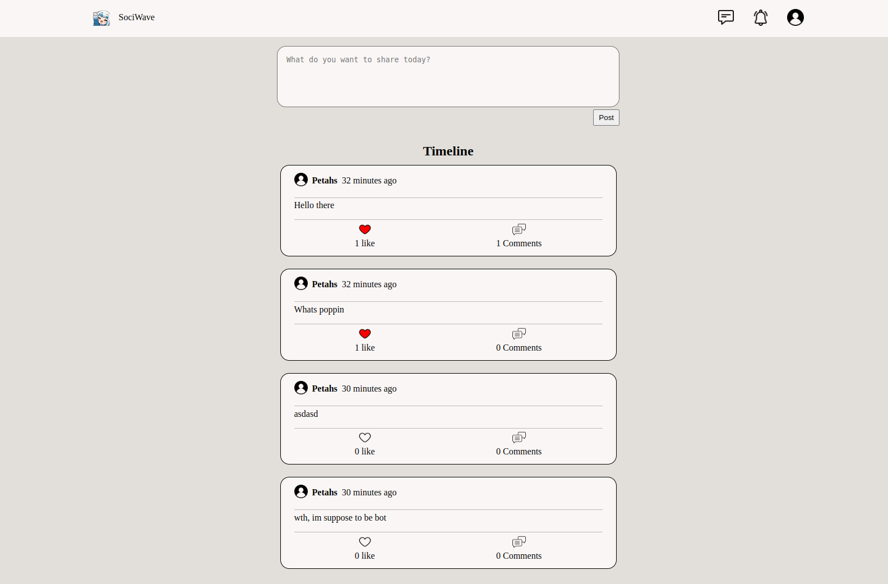

# Social Media App

My take on a simple social media application. Welcome to our Social Media App! This application allows users to create accounts, confirm their accounts, comment on posts, like posts, send friend requests, and manage friends.

## Technologies Used

- Ruby on Rails
- Devise for user authentication
- Turbo
- Github Omniauth

## Features

### Account Management
- Users can sign up for an account.
- Confirmation emails are sent for account verification.

### Post Management
- Users can create new posts.
- Posts are displayed on the timeline.

### Interaction
- Users can comment on posts.
- Users can like posts.
- Users can send friend requests.
- Users can manage their friends list.

## Installation
To set up this project locally, follow these steps:

### Linux

1. Open a terminal.
2. Ensure you have Ruby installed by running `ruby --version`. 

        ruby --version
If not, install Ruby by following [these steps](https://www.theodinproject.com/lessons/ruby-installing-ruby) provided by the Odin Project

3. With Ruby installed, you can now install Rails:

        gem install rails
4. Clone this repository to your local machine.

        git clone https://github.com/PeterG-ithub/sociwave.git
        cd sociwave

5. Install the required Ruby gems using Bundler. If you encounter Ruby version errors here, change the version of ruby in the Gemfile

        bunle update
        bundle install
6. Install PostgreSQL by following [these steps](https://www.theodinproject.com/lessons/ruby-on-rails-installing-postgresql) provided by the Odin Project
7. Change the username in **config/database.yml** to your PostgreSQL role name
8. Set up the database by running the following commands:

        rails db:create
        rails db:migrate
9. Start the Rails server to run the application locally:

        rails server

10. Open browser and go to the link:
        
        http://localhost:3000/

## Credits
This Ruby Project is part of the curriculum provided by The Odin Project, an open-source online platform that offers free resources to learn web development.
- **Website**: [The Odin Project](https://www.theodinproject.com/)
- **Project**: [Rails final project](https://www.theodinproject.com/lessons/ruby-on-rails-rails-final-project)

## Screenshot Demo

